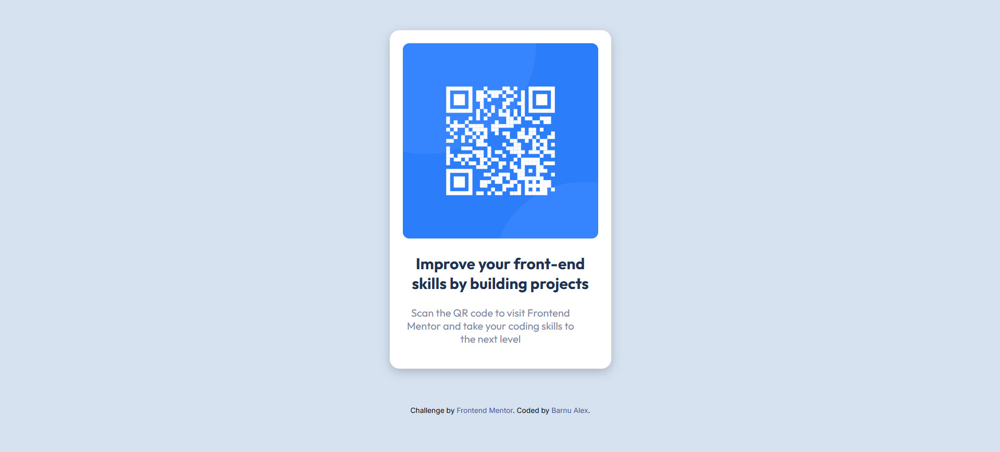

# qr-code-component
 Frontend Mentor - QR Code Component Challenge

# This is the prieview of the project

# Welcome! 👋

This repository contains my solution for the [Frontend Mentor](https://www.frontendmentor.io) QR Code Component challenge.  
This challenge provided a great opportunity to refine my HTML and CSS skills by working on a structured, real-world project.  
It was an engaging experience that allowed me to focus on writing clean, semantic code while ensuring a responsive and visually accurate design.

# My Process

    Built With
      - Semantic HTML5 markup
        - CSS custom properties
        - Flexbox for layout
        - Mobile-first workflow

 ### Links

- **Solution URL:** [View on Frontend Mentor](https://your-solution-url.com)
- **Live Demo:** [View Live Project](https://your-live-site-url.com)       

## What I Learned
    While working on this project, I improved my understanding of:

    Structuring a simple yet effective HTML component

    Using CSS Grid and Flexbox to create responsive layouts

    Applying custom properties for better maintainability

 Here’s a small snippet of my CSS for the QR code container:
///css
    body{
    background-color: hsl(212, 45%, 89%);
    display: flex;
    flex-direction: column;
    justify-content: center;
    align-items: center;
    height: 100vh;
    margin: 0;
}

## Future Improvements

In future projects, I’d like to:

    Explore using CSS animations for subtle hover effects

    Implement a dark mode option

    Experiment with CSS frameworks like TailwindCSS

##  Useful Resources
         - Flexbox - Helped me fine-tune alignment.

         - Grid Guide - Reference for using CSS Grid efficiently.

## Author

  GitHub: alexbarnu34
  Frontend Mentor: alexbarnu34